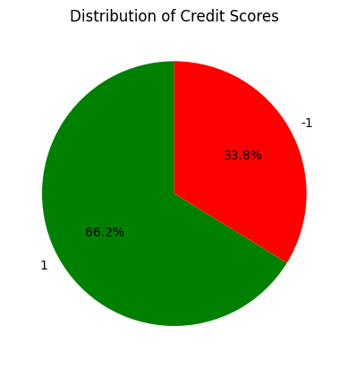
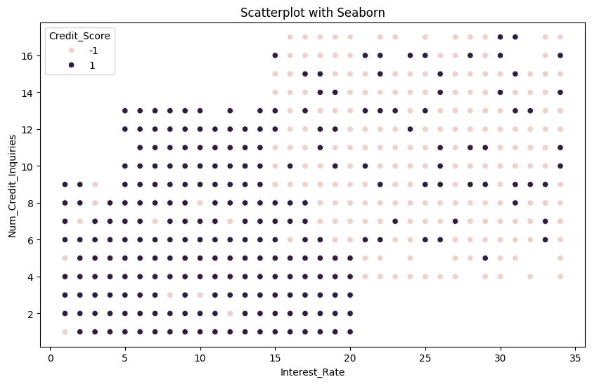
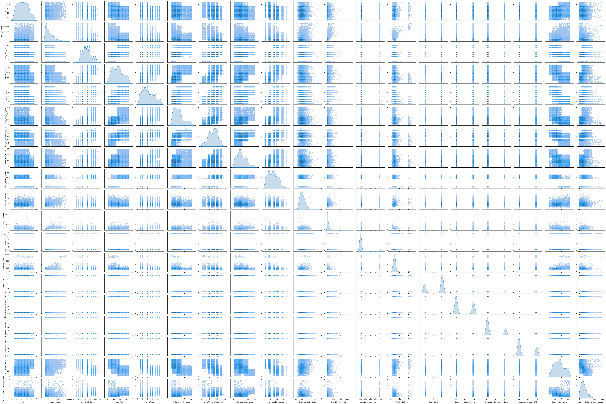
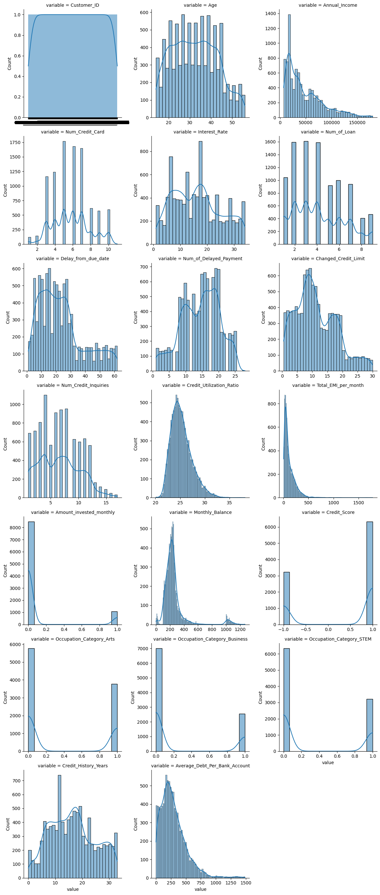
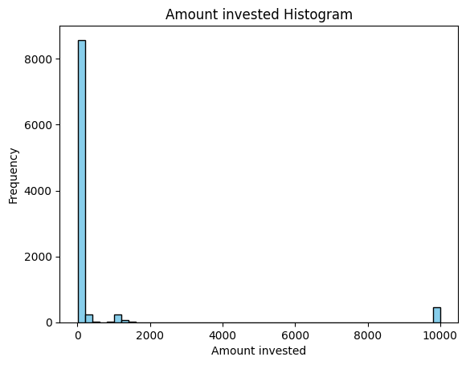
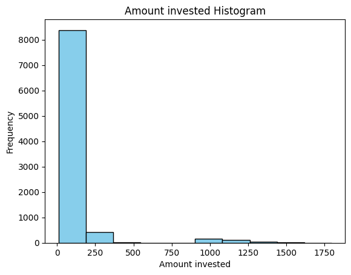
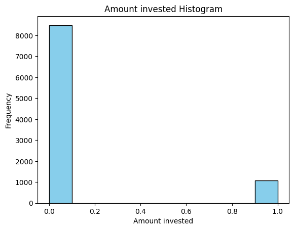
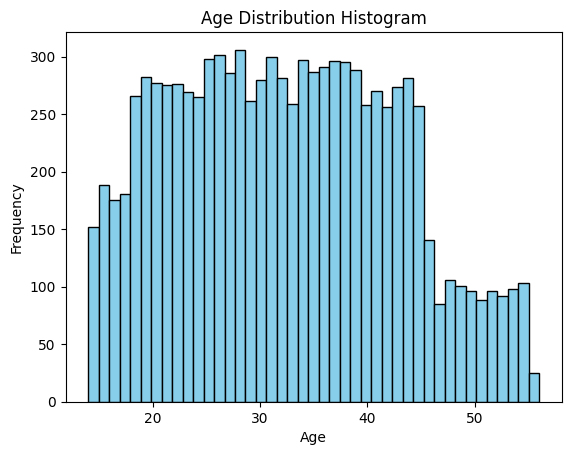
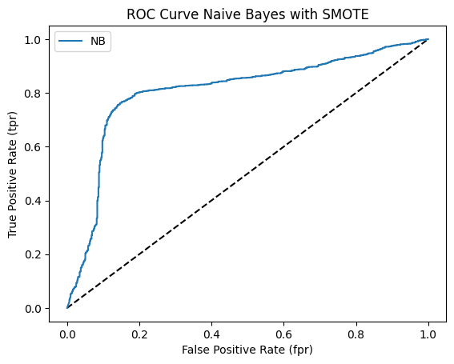

# Classification Model to predict credit score 

***About the dataset:*** 

The dataset is available on Kaggle website at https://www.kaggle.com/datasets/parisrohan/credit-score-classification/data. 

The data is presented as a challenge to predict credit score given a customer's bank details. 

The dataset itself is some example data given to help predict new information. There are over 27 columns and 100000 rows in this dataset, with around 8 rows each for 12500 unique customers.

***Objective:*** Classify a customer's credit score as "good" or "poor", given customer financial data.

***Approach:*** 

- We are going to take the following steps to build a classification model: 
    1. Handle missing, NAN, inf data
    2. Consolidate similar rows together and standardize/cleanup data
    3. Select important features to build our models based on data exploration
    4. Create or delete features/columns based on results of data explorations
    5. Build base classifiers models on the data
    6. Ensemble the results together to get a more accurate accuracy score

### Importing libraries


```python
import numpy as np
import pandas as pd
import seaborn as sns
import matplotlib.pyplot as plt

from sklearn.model_selection import GridSearchCV, train_test_split, cross_val_score, StratifiedKFold, cross_val_predict
from sklearn.tree import DecisionTreeClassifier
from sklearn.metrics import accuracy_score, make_scorer, classification_report, confusion_matrix
from sklearn.ensemble import RandomForestClassifier
from sklearn.svm import SVC
from sklearn.preprocessing import StandardScaler
from sklearn.pipeline import Pipeline, make_pipeline
from sklearn.neighbors import KNeighborsClassifier
from sklearn.naive_bayes import GaussianNB
from imblearn.over_sampling import SMOTE
```

### Reading Data


```python
data = pd.read_csv("train.csv")
data.head()
print(len(data))
data.head()
```

    C:\Users\Yash\AppData\Local\Temp\ipykernel_32612\2988695618.py:1: DtypeWarning: Columns (26) have mixed types. Specify dtype option on import or set low_memory=False.
      data = pd.read_csv("train.csv")


    100000


<div>
<style scoped>
    .dataframe tbody tr th:only-of-type {
        vertical-align: middle;
    }

    .dataframe tbody tr th {
        vertical-align: top;
    }

    .dataframe thead th {
        text-align: right;
    }
</style>
<table border="1" class="dataframe">
  <thead>
    <tr style="text-align: right;">
      <th></th>
      <th>ID</th>
      <th>Customer_ID</th>
      <th>Month</th>
      <th>Name</th>
      <th>Age</th>
      <th>SSN</th>
      <th>Occupation</th>
      <th>Annual_Income</th>
      <th>Monthly_Inhand_Salary</th>
      <th>Num_Bank_Accounts</th>
      <th>...</th>
      <th>Credit_Mix</th>
      <th>Outstanding_Debt</th>
      <th>Credit_Utilization_Ratio</th>
      <th>Credit_History_Age</th>
      <th>Payment_of_Min_Amount</th>
      <th>Total_EMI_per_month</th>
      <th>Amount_invested_monthly</th>
      <th>Payment_Behaviour</th>
      <th>Monthly_Balance</th>
      <th>Credit_Score</th>
    </tr>
  </thead>
  <tbody>
    <tr>
      <th>0</th>
      <td>0x1602</td>
      <td>CUS_0xd40</td>
      <td>January</td>
      <td>Aaron Maashoh</td>
      <td>23</td>
      <td>821-00-0265</td>
      <td>Scientist</td>
      <td>19114.12</td>
      <td>1824.843333</td>
      <td>3</td>
      <td>...</td>
      <td>_</td>
      <td>809.98</td>
      <td>26.822620</td>
      <td>22 Years and 1 Months</td>
      <td>No</td>
      <td>49.574949</td>
      <td>80.41529543900253</td>
      <td>High_spent_Small_value_payments</td>
      <td>312.49408867943663</td>
      <td>Good</td>
    </tr>
    <tr>
      <th>1</th>
      <td>0x1603</td>
      <td>CUS_0xd40</td>
      <td>February</td>
      <td>Aaron Maashoh</td>
      <td>23</td>
      <td>821-00-0265</td>
      <td>Scientist</td>
      <td>19114.12</td>
      <td>NaN</td>
      <td>3</td>
      <td>...</td>
      <td>Good</td>
      <td>809.98</td>
      <td>31.944960</td>
      <td>NaN</td>
      <td>No</td>
      <td>49.574949</td>
      <td>118.28022162236736</td>
      <td>Low_spent_Large_value_payments</td>
      <td>284.62916249607184</td>
      <td>Good</td>
    </tr>
    <tr>
      <th>2</th>
      <td>0x1604</td>
      <td>CUS_0xd40</td>
      <td>March</td>
      <td>Aaron Maashoh</td>
      <td>-500</td>
      <td>821-00-0265</td>
      <td>Scientist</td>
      <td>19114.12</td>
      <td>NaN</td>
      <td>3</td>
      <td>...</td>
      <td>Good</td>
      <td>809.98</td>
      <td>28.609352</td>
      <td>22 Years and 3 Months</td>
      <td>No</td>
      <td>49.574949</td>
      <td>81.699521264648</td>
      <td>Low_spent_Medium_value_payments</td>
      <td>331.2098628537912</td>
      <td>Good</td>
    </tr>
    <tr>
      <th>3</th>
      <td>0x1605</td>
      <td>CUS_0xd40</td>
      <td>April</td>
      <td>Aaron Maashoh</td>
      <td>23</td>
      <td>821-00-0265</td>
      <td>Scientist</td>
      <td>19114.12</td>
      <td>NaN</td>
      <td>3</td>
      <td>...</td>
      <td>Good</td>
      <td>809.98</td>
      <td>31.377862</td>
      <td>22 Years and 4 Months</td>
      <td>No</td>
      <td>49.574949</td>
      <td>199.4580743910713</td>
      <td>Low_spent_Small_value_payments</td>
      <td>223.45130972736786</td>
      <td>Good</td>
    </tr>
    <tr>
      <th>4</th>
      <td>0x1606</td>
      <td>CUS_0xd40</td>
      <td>May</td>
      <td>Aaron Maashoh</td>
      <td>23</td>
      <td>821-00-0265</td>
      <td>Scientist</td>
      <td>19114.12</td>
      <td>1824.843333</td>
      <td>3</td>
      <td>...</td>
      <td>Good</td>
      <td>809.98</td>
      <td>24.797347</td>
      <td>22 Years and 5 Months</td>
      <td>No</td>
      <td>49.574949</td>
      <td>41.420153086217326</td>
      <td>High_spent_Medium_value_payments</td>
      <td>341.48923103222177</td>
      <td>Good</td>
    </tr>
  </tbody>
</table>
<p>5 rows × 28 columns</p>
</div>


***Attributes:***
- ID - Represents a unique identification of an entry(Continous)
- CustomerID - Represents a unique identification of a person(Continuos)
- Month - Represents the month of the year(Nominal)
- Name - Represents the name of a person(Nominal)
- Age - Represents the age of the person
- SSN - Represents the social security number of a person
- Occupation - Represents the occupation of the person
- Annual_Income - Represents the annual income of the person
- Monthly_Inhand_Salary - Represents the monthly base salary of a person
- Num_Bank_Accounts - Represents the number of bank accounts a person holds
- Num_Credit_Card - Represents the number of other credit cards held by a person
- Interest_Rate - Represents the interest rate on credit card
- Num_of_Loan - Represents the number of loans taken from the bank
- Type_of_Loan - Represents the types of loan taken by a person
- Delay_from_due_date - Represents the average number of days delayed from the payment date
- Num_of_Delayed_Payment - Represents the average number of payments delayed by a person
- Changed_Credit_Limit - Represents the percentage change in credit card limit
- Num_Credit_Inquiries - Represents the number of credit card inquiries
- Credit_Mix - Represents the classification of the mix of credits
- Outstanding_Debt - Represents the remaining debt to be paid (in USD)
- Credit_Utilization_Ratio - Represents the utilization ratio of credit card
- Credit_History_Age - Represents the age of credit history of the person
- Payment_of_Min_Amount - Represents whether only the minimum amount was paid by the person
- Total_EMI_per_month - Represents the monthly EMI payments (in USD)
- Amount_invested_monthly - Represents the monthly amount invested by the customer (in USD)
- Payment_Behaviour - Represents the payment behavior of the customer (in USD)
- Monthly_Balance - Represents the monthly balance amount of the customer (in USD)

***Label:***
- Credit Score - A rating of "Good", "Standard", or "Poor"

For our predicted classification, we group the "Good" and "Standard" together as "Good", and framed this problem as a binary classification problem.

### Data Preprocessing: Cleaning and Feature Engineering

We want to delete the name and SSN from this data to reduce dimensionality. Name and SSN don't have significance
in this data to predict credit score. We will use Customer_ID to uniquely identify each person.

Each customer ID has several rows dedicated for them for each month's info. We will combine these records in one row.

We decided to take the mode of the columns for the set of rows associated per customer ID. Before taking the average, we need to clean the rows that have negatives and '-' (bad data).


```python
df = data.drop(['Name', 'SSN', 'Type_of_Loan', 'Payment_Behaviour', 'Monthly_Inhand_Salary', 'Payment_of_Min_Amount', 'Credit_Mix'], axis=1)
```

As you notice above, we are also dropping several other columns which we decided were not useful as we continued our data exploration and cleaning.


```python
mode_ages = df.groupby('Customer_ID')['Age'].apply(lambda x: x.mode().iloc[0] if not x.mode().empty else None)
df['Age'] = df.apply(lambda row: mode_ages[row['Customer_ID']] if pd.notnull(row['Age']) else None, axis=1)
```


```python
df['Age'].value_counts()
```


    28      3136
    31      3104
    26      3048
    25      3016
    38      2992
    36      2952
    39      2952
    44      2936
    34      2920
    37      2920
    27      2920
    35      2904
    22      2896
    32      2856
    41      2840
    19      2824
    20      2816
    30      2816
    23      2792
    29      2768
    43      2744
    21      2744
    40      2736
    24      2664
    42      2664
    45      2640
    33      2640
    18      2568
    46      1704
    15      1600
    17      1568
    16      1480
    48      1464
    53      1424
    55      1416
    52      1376
    49      1352
    51      1344
    50      1328
    54      1320
    14      1256
    47      1208
    56       328
    41_        8
    -500       8
    44_        8
    Name: Age, dtype: int64


As you see, there are still some ages with underscores and negative values. We need to fix these rows. This is done below.


```python
df['Age'] = pd.to_numeric(df['Age'].astype(str).str.replace('_', ''), errors='coerce')
df = df.dropna(subset=['Age'])
df = df[df['Age'] >= 0]
df.reset_index(drop=True, inplace=True)
```


```python
df['Age'].value_counts()
```


    28    3136
    31    3104
    26    3048
    25    3016
    38    2992
    36    2952
    39    2952
    44    2944
    34    2920
    27    2920
    37    2920
    35    2904
    22    2896
    32    2856
    41    2848
    19    2824
    20    2816
    30    2816
    23    2792
    29    2768
    43    2744
    21    2744
    40    2736
    24    2664
    42    2664
    45    2640
    33    2640
    18    2568
    46    1704
    15    1600
    17    1568
    16    1480
    48    1464
    53    1424
    55    1416
    52    1376
    49    1352
    51    1344
    50    1328
    54    1320
    14    1256
    47    1208
    56     328
    Name: Age, dtype: int64


We now fix the occupations column, since it is categorical data. Since there are a large number of occupations, we decided to categorize them into 3 categories and one hot encode for each row. This provides a balance between dimensionality and the predictive power of the feature.


```python
df['Occupation'].value_counts()
```


    _______          7061
    Lawyer           6575
    Architect        6355
    Engineer         6350
    Scientist        6299
    Mechanic         6291
    Accountant       6271
    Developer        6235
    Media_Manager    6232
    Teacher          6215
    Entrepreneur     6174
    Doctor           6087
    Journalist       6085
    Manager          5973
    Musician         5904
    Writer           5885
    Name: Occupation, dtype: int64


```python
occupation_categories = {
    'Lawyer': 'Arts',
    'Architect': 'STEM',
    'Engineer': 'STEM',
    'Scientist': 'STEM',
    'Mechanic': 'Business',
    'Accountant': 'Business',
    'Developer': 'STEM',
    'Media_Manager': 'Arts',
    'Teacher': 'Arts',
    'Entrepreneur': 'Business',
    'Doctor': 'STEM',
    'Journalist': 'Arts',
    'Manager': 'Business',
    'Musician': 'Arts',
    'Writer': 'Arts'
}

df['Occupation_Category'] = df['Occupation'].map(occupation_categories)
df_encoded = pd.get_dummies(df, columns=['Occupation_Category'], prefix='Occupation_Category')
df_encoded.drop(['Occupation'], axis=1, inplace=True)

df['Occupation_Category'].value_counts()
```


    Arts        36896
    STEM        31326
    Business    24709
    Name: Occupation_Category, dtype: int64


We now look at Annual Income-- we see that once again, there are several rows where there are ill-formatted values with underscores. We clean this below.


```python
df_encoded['Annual_Income'].value_counts()
```


    36585.12      16
    20867.67      16
    17273.83      16
    33029.66      15
    17816.75      15
                  ..
    73773.48_      1
    33199.13_      1
    10494.44_      1
    172441.08_     1
    29101.2_       1
    Name: Annual_Income, Length: 18938, dtype: int64


```python
mode_income = df_encoded.groupby('Customer_ID')['Annual_Income'].apply(lambda x: x.mode().iloc[0] if not x.mode().empty else None)
df_encoded['Annual_Income'] = df_encoded.apply(lambda row: mode_income[row['Customer_ID']] if pd.notnull(row['Annual_Income']) else None, axis=1)

df_encoded['Annual_Income'] = pd.to_numeric(df_encoded['Annual_Income'].astype(str).str.replace('_', ''), errors='coerce')
df_encoded = df_encoded.dropna(subset=['Annual_Income'])
df_encoded = df_encoded[df_encoded['Annual_Income'] >= 0]
df_encoded.reset_index(drop=True, inplace=True)
```


```python
df_encoded['Annual_Income'].value_counts()
# fixed below
```


    109945.320    16
    9141.630      16
    22434.160     16
    20867.670     16
    36585.120     16
                  ..
    14784.450      8
    60573.960      8
    18413.795      8
    30622.730      8
    39628.990      8
    Name: Annual_Income, Length: 12487, dtype: int64


Recall that the dataset has a row for each of the 8 months of the 12500 customers. We're going to consolidate all the months of a customer into 1 row in the future, so we need to find a way to combine rows.

We noticed a pattern here that for all columns-- we want the mode of all rows per customer_id. We didn't use mean here because there are too many missing values, and the variation by month is 0 or close to 0 anyway.

We also handle bad formats with underscores here as well.


```python
columns_to_process = [
    'Num_Bank_Accounts',
    'Num_Credit_Card',
    'Interest_Rate',
    'Num_of_Loan',
    'Delay_from_due_date',
    'Num_of_Delayed_Payment',
    'Changed_Credit_Limit',
    'Num_Credit_Inquiries',
    'Outstanding_Debt',
    'Credit_Utilization_Ratio',
    'Total_EMI_per_month',
    'Amount_invested_monthly',
    'Monthly_Balance',
    'Occupation_Category_Arts',
    'Occupation_Category_Business',
    'Occupation_Category_STEM'
]

for column in columns_to_process:
    mode_values = df_encoded.groupby('Customer_ID')[column].apply(lambda x: x.mode().iloc[0] if not x.mode().empty else None)
    df_encoded[column] = df_encoded.apply(lambda row: mode_values[row['Customer_ID']] if pd.notnull(row[column]) else None, axis=1)
    df_encoded[column] = pd.to_numeric(df_encoded[column].astype(str).str.replace('_', ''), errors='coerce')

df_encoded = df_encoded[~df_encoded.isin([np.inf, -np.inf, np.nan]).any(axis=1)]
df_encoded.reset_index(drop=True, inplace=True)
```

Below, we do some feature engineering/cleaning here to truncate the months in the Credit_History_Age column to map to the Credit_History_Years column. This converts the previously nonnumeric data into numeric data. 


```python
def extract_years(age_str):
    if pd.notnull(age_str) and 'Year' in age_str:
        return int(age_str.split(' ')[0])
    else:
        return 0

df_encoded['Credit_History_Years'] = df_encoded['Credit_History_Age'].apply(extract_years)
df_encoded.drop(['Credit_History_Age'], axis=1, inplace=True)
```


```python
mode_values = df_encoded.groupby('Customer_ID')['Credit_History_Years'].apply(lambda x: x.mode().iloc[0] if not x.mode().empty else None)
df_encoded['Credit_History_Years'] = df_encoded.apply(lambda row: mode_values[row['Customer_ID']] if pd.notnull(row['Credit_History_Years']) else None, axis=1)
df_encoded['Credit_History_Years'] = pd.to_numeric(df_encoded['Credit_History_Years'].astype(str).str.replace('_', ''), errors='coerce')
df_encoded.reset_index(drop=True, inplace=True)
```


```python
df_consolidated = df_encoded.groupby('Customer_ID').first().reset_index()
```

We are consolidating the different months of a specific customer into one row for the unique customer and consolidating the other information as shown in the steps from above. All the values for a specific customers are the same over the different months, and we consolidate all their rows into one specific row. We do this to make sure we can reduce the overall volume of data that we are dealing with allowing for all the models to run more efficiently.

We also drop the Month and ID features, because they were only used as identifiers for the same person over time.


```python
df_final = df_consolidated.drop(['Month', 'ID'], axis=1)
df_final.columns
```


    Index(['Customer_ID', 'Age', 'Annual_Income', 'Num_Bank_Accounts',
           'Num_Credit_Card', 'Interest_Rate', 'Num_of_Loan',
           'Delay_from_due_date', 'Num_of_Delayed_Payment', 'Changed_Credit_Limit',
           'Num_Credit_Inquiries', 'Outstanding_Debt', 'Credit_Utilization_Ratio',
           'Total_EMI_per_month', 'Amount_invested_monthly', 'Monthly_Balance',
           'Credit_Score', 'Occupation_Category_Arts',
           'Occupation_Category_Business', 'Occupation_Category_STEM',
           'Credit_History_Years'],
          dtype='object')


```python
columns_to_check = [
    'Num_Bank_Accounts',
    'Num_Credit_Card',
    'Interest_Rate',
    'Num_of_Loan',
    'Delay_from_due_date',
    'Num_of_Delayed_Payment',
    'Changed_Credit_Limit',
    'Num_Credit_Inquiries',
    'Outstanding_Debt',
    'Credit_Utilization_Ratio',
    'Total_EMI_per_month',
    'Amount_invested_monthly',
    'Monthly_Balance'
]

df_final = df_final[(df_final[columns_to_check] > 0).all(axis=1)]
df_final.reset_index(drop=True, inplace=True)
```

We have now finished a significant amount of data cleaning. We have deleted unnessary columns, imputed missing values, and consolidated our dataset. We also got rid of rows that have bad characters and negative values for columns that don't make sense to have negative values.

We now create a new feature for average debt per account which combines Outstanding_Debt and Num_Bank_Accounts. We tehn drop these two columns to reduce dimensionality, hoping that the information is encoded in the engineered feature. 


```python
df_final['Average_Debt_Per_Bank_Account'] = df_final['Outstanding_Debt'] / df_final['Num_Bank_Accounts']
df_final.drop(['Outstanding_Debt', 'Num_Bank_Accounts'], axis=1, inplace=True)
```

Lastly, we decided to group the Standard and Good class label together and keep Poor as the other class label because we thought it would be a good indicator of if someone is approved of a loan (Yes/No).


```python
df_final['Credit_Score'] = df_final['Credit_Score'].replace({'Good': 1, 'Standard': 1, 'Poor': -1})
```

# Data Exploration


```python
df_final[['Age', 'Annual_Income', 'Average_Debt_Per_Bank_Account', 'Num_Credit_Card', 'Interest_Rate', 
                       'Num_of_Loan', 'Delay_from_due_date', 'Num_of_Delayed_Payment', 'Changed_Credit_Limit',
                       'Num_Credit_Inquiries', 'Credit_Utilization_Ratio',
                       'Total_EMI_per_month', 'Amount_invested_monthly', 'Monthly_Balance', 'Credit_Score', 'Credit_History_Years']].describe()
```


<div>
<style scoped>
    .dataframe tbody tr th:only-of-type {
        vertical-align: middle;
    }

    .dataframe tbody tr th {
        vertical-align: top;
    }

    .dataframe thead th {
        text-align: right;
    }
</style>
<table border="1" class="dataframe">
  <thead>
    <tr style="text-align: right;">
      <th></th>
      <th>Age</th>
      <th>Annual_Income</th>
      <th>Average_Debt_Per_Bank_Account</th>
      <th>Num_Credit_Card</th>
      <th>Interest_Rate</th>
      <th>Num_of_Loan</th>
      <th>Delay_from_due_date</th>
      <th>Num_of_Delayed_Payment</th>
      <th>Changed_Credit_Limit</th>
      <th>Num_Credit_Inquiries</th>
      <th>Credit_Utilization_Ratio</th>
      <th>Total_EMI_per_month</th>
      <th>Amount_invested_monthly</th>
      <th>Monthly_Balance</th>
      <th>Credit_Score</th>
      <th>Credit_History_Years</th>
    </tr>
  </thead>
  <tbody>
    <tr>
      <th>count</th>
      <td>9559.000000</td>
      <td>9559.000000</td>
      <td>9559.000000</td>
      <td>9559.000000</td>
      <td>9559.000000</td>
      <td>9559.000000</td>
      <td>9559.000000</td>
      <td>9559.000000</td>
      <td>9559.000000</td>
      <td>9559.000000</td>
      <td>9559.000000</td>
      <td>9559.000000</td>
      <td>9559.000000</td>
      <td>9559.000000</td>
      <td>9559.000000</td>
      <td>9559.000000</td>
    </tr>
    <tr>
      <th>mean</th>
      <td>32.343969</td>
      <td>47240.281926</td>
      <td>288.177385</td>
      <td>5.800607</td>
      <td>16.200753</td>
      <td>4.182132</td>
      <td>23.511246</td>
      <td>14.510095</td>
      <td>11.285067</td>
      <td>6.613976</td>
      <td>25.266172</td>
      <td>118.950923</td>
      <td>611.565645</td>
      <td>253.771821</td>
      <td>0.324616</td>
      <td>16.381107</td>
    </tr>
    <tr>
      <th>std</th>
      <td>10.489350</td>
      <td>35835.093270</td>
      <td>211.479255</td>
      <td>2.075675</td>
      <td>8.819134</td>
      <td>2.253636</td>
      <td>15.192166</td>
      <td>5.737207</td>
      <td>6.745292</td>
      <td>3.615687</td>
      <td>2.099805</td>
      <td>120.349946</td>
      <td>2080.376228</td>
      <td>174.437598</td>
      <td>0.945896</td>
      <td>8.273524</td>
    </tr>
    <tr>
      <th>min</th>
      <td>14.000000</td>
      <td>7005.930000</td>
      <td>0.042500</td>
      <td>1.000000</td>
      <td>1.000000</td>
      <td>1.000000</td>
      <td>1.000000</td>
      <td>1.000000</td>
      <td>0.500000</td>
      <td>1.000000</td>
      <td>20.100770</td>
      <td>4.462837</td>
      <td>10.010194</td>
      <td>0.007760</td>
      <td>-1.000000</td>
      <td>0.000000</td>
    </tr>
    <tr>
      <th>25%</th>
      <td>24.000000</td>
      <td>18620.400000</td>
      <td>142.642500</td>
      <td>4.000000</td>
      <td>9.000000</td>
      <td>2.000000</td>
      <td>12.000000</td>
      <td>10.000000</td>
      <td>6.340000</td>
      <td>4.000000</td>
      <td>23.750327</td>
      <td>42.111903</td>
      <td>106.156616</td>
      <td>176.570395</td>
      <td>-1.000000</td>
      <td>10.000000</td>
    </tr>
    <tr>
      <th>50%</th>
      <td>32.000000</td>
      <td>35413.430000</td>
      <td>248.365714</td>
      <td>6.000000</td>
      <td>16.000000</td>
      <td>4.000000</td>
      <td>21.000000</td>
      <td>15.000000</td>
      <td>10.120000</td>
      <td>6.000000</td>
      <td>24.944097</td>
      <td>78.229629</td>
      <td>118.837364</td>
      <td>224.132692</td>
      <td>1.000000</td>
      <td>16.000000</td>
    </tr>
    <tr>
      <th>75%</th>
      <td>40.000000</td>
      <td>66592.740000</td>
      <td>389.046667</td>
      <td>7.000000</td>
      <td>22.000000</td>
      <td>6.000000</td>
      <td>30.000000</td>
      <td>19.000000</td>
      <td>16.150000</td>
      <td>9.000000</td>
      <td>26.441445</td>
      <td>163.678827</td>
      <td>145.114437</td>
      <td>263.697270</td>
      <td>1.000000</td>
      <td>22.000000</td>
    </tr>
    <tr>
      <th>max</th>
      <td>56.000000</td>
      <td>179987.280000</td>
      <td>1485.870000</td>
      <td>11.000000</td>
      <td>34.000000</td>
      <td>9.000000</td>
      <td>62.000000</td>
      <td>28.000000</td>
      <td>29.980000</td>
      <td>17.000000</td>
      <td>38.112157</td>
      <td>1779.103254</td>
      <td>10000.000000</td>
      <td>1271.056599</td>
      <td>1.000000</td>
      <td>33.000000</td>
    </tr>
  </tbody>
</table>
</div>


Below, we see the imbalance of class between Good and Poor classifications. We will use techniques like SMOTE to oversample underrepresented classes.


```python
counts = df_final['Credit_Score'].value_counts()

# Plot a pie chart
plt.pie(counts, labels=counts.index, autopct='%1.1f%%', startangle=90, colors=['green', 'red'])
plt.title('Distribution of Credit Scores')
plt.show()
```


    

    


```python
correlation_matrix = df_final[['Age', 'Annual_Income', 'Average_Debt_Per_Bank_Account', 'Num_Credit_Card', 'Interest_Rate',
                                       'Num_of_Loan', 'Delay_from_due_date', 'Num_of_Delayed_Payment',
                                       'Changed_Credit_Limit', 'Num_Credit_Inquiries',
                                       'Credit_Utilization_Ratio', 'Total_EMI_per_month', 'Amount_invested_monthly',
                                       'Monthly_Balance', 'Credit_History_Years']].corr()

plt.figure(figsize=(12, 10))
sns.heatmap(correlation_matrix, annot=True, cmap='coolwarm', fmt='.2f', linewidths=.5)
plt.show()
```


    

    


We see that the highest correlation in the matrix is between interest rate and number of credit inquiries. 
Is this a high enough correlation to drop one of the columns? 

If we perform PCA in hopes to reduce dimensionality while keeping variation, we'd lose understanding of our features. We decide that this is not currently necessary, and will reevaluate later.


```python
plt.figure(figsize=(10, 6))
sns.scatterplot(x='Interest_Rate', y='Num_Credit_Inquiries', hue='Credit_Score', data=df_final)
plt.title('Scatterplot with Seaborn')
plt.xlabel('Interest_Rate')
plt.ylabel('Num_Credit_Inquiries')
plt.show()
```


    

    


The above graph shows 2 obvious clusters. The people who have a higher interest rate and more number of credit inquiries seem to have a poorer credit score, which makes sense. This gives confidence that these features will have high predictive power.


```python
plt.figure(figsize=(10, 6))
sns.scatterplot(x='Average_Debt_Per_Bank_Account', y='Interest_Rate', hue='Credit_Score', data=df_final)
plt.title('Scatterplot with Seaborn')
plt.xlabel('Average_Debt_Per_Bank_Account')
plt.ylabel('Interest_Rate')
plt.show()
```


    

    


The above graph shows 2 clusters too. This one is a little more mixed. However, we can see that on average the higher the debt per bank account between 200 and 800 and high interest rate indicated more people with poorer credit scores.

We hope that this clustering is more apparent and distinct in higher dimensions.

Below, we look at the grid of all univariate/bivariate relationships. We focus mainly on the univariate graphs and solely plot them afterwards. The diagonal is the univariate graphs.


```python
sns.pairplot(df_final, height=2, aspect=1.5, kind="hist", diag_kind="kde")
```


    <seaborn.axisgrid.PairGrid at 0x245ab865990>


    

    


We now provide unvariate graphs of all the features individually. Due to their mostly peaked distributions, it seems reasonable to scale each feature using standard scaling to a normal distribution.


```python
g = sns.FacetGrid(pd.melt(df_final), col="variable", col_wrap=3, height=4, sharex=False, sharey=False)
g.map(sns.histplot, "value", kde=True)
plt.show()
```


    

    


We see that the Amounts_invested_monthly graph seems to have outliers. This wouldn't be good for any scaling method, and would provide no predictive power for the majority of the data. 


```python
plt.hist(df_final['Amount_invested_monthly'], bins=50, color='skyblue', edgecolor='black')

plt.xlabel('Amount invested')
plt.ylabel('Frequency')
plt.title('Amount invested Histogram')
plt.show()

plt.hist(df_final[df_final['Amount_invested_monthly'] < 4000]['Amount_invested_monthly'], bins=10, color='skyblue', edgecolor='black')

plt.xlabel('Amount invested')
plt.ylabel('Frequency')
plt.title('Amount invested Histogram')
plt.show()


bins = pd.qcut(df_final[df_final['Amount_invested_monthly'] < 4000]['Amount_invested_monthly'], q=10)  # You can adjust the number of quantiles (q) as needed

# Use value_counts to count occurrences within each bin
bin_counts = bins.value_counts(sort=True)
print(bin_counts)

```


    

    


    

    


    (10.009, 100.615]     912
    (103.908, 107.513]    912
    (111.804, 117.317]    912
    (133.135, 147.465]    912
    (178.099, 1797.63]    912
    (100.615, 103.908]    911
    (107.513, 111.804]    911
    (117.317, 123.986]    911
    (123.986, 133.135]    911
    (147.465, 178.099]    911
    Name: Amount_invested_monthly, dtype: int64


To handle this, we decided to engineer the Amounts_invested into a binary feature, with a 1 above a threshold and a 0 otherwise. This threshold was chosen to be around the 80/90th percentile.


```python
threshold = 200
df_final['Amount_invested_monthly'] = np.where(df_final['Amount_invested_monthly'] >= threshold, 1, 0)

plt.hist(df_final['Amount_invested_monthly'], bins=10, color='skyblue', edgecolor='black')

plt.xlabel('Amount invested')
plt.ylabel('Frequency')
plt.title('Amount invested Histogram')
plt.show()
```


    

    


```python
plt.hist(df_final['Age'], bins=43, color='skyblue', edgecolor='black')

plt.xlabel('Age')
plt.ylabel('Frequency')
plt.title('Age Distribution Histogram')

plt.show()
```


    

    


The age histogram looked abnormal, so we examine it further. The data now seems normal, and the spikes in the original graph came from the bins not including many integer values.

Since the ages seem to be uniformly distributed till age 45, we might be able to more accurately predict the credit score (good/bad) for someone within this age range (18 - 45).

### Data Setup


```python
features_columns = ['Age', 'Annual_Income', 'Num_Credit_Card',
       'Interest_Rate', 'Num_of_Loan', 'Delay_from_due_date',
       'Num_of_Delayed_Payment', 'Changed_Credit_Limit',
       'Num_Credit_Inquiries', 'Credit_Utilization_Ratio',
       'Total_EMI_per_month', 'Amount_invested_monthly', 'Monthly_Balance', 'Occupation_Category_Arts',
       'Occupation_Category_Business', 'Occupation_Category_STEM',
       'Credit_History_Years', 'Average_Debt_Per_Bank_Account']

class_labels = df_final['Credit_Score']
features = df_final[features_columns]
```

## Modelling

### Decision Trees / Random Forests

We are going to work tuning a Decision Tree Model. We first ran a regular decision tree using SMOTE to balance our dataset. After this, we decided to run a CV and a nested CV by using GridSearch for the nested.


```python
X_train, X_test, y_train, y_test = train_test_split(features, class_labels, test_size=0.2, random_state=42)
smote = SMOTE(random_state=42)
X_train_resampled, y_train_resampled = smote.fit_resample(X_train, y_train)

model = DecisionTreeClassifier(criterion='entropy')
model.fit(X_train_resampled, y_train_resampled)
predictions = model.predict(X_test)

accuracy = accuracy_score(y_test, predictions)
print("Accuracy:", accuracy)
```

    Accuracy: 0.7599372384937239


```python
# Cross Val


hyperparams = {
    'max_depth': [5, 10, 15, 20],
    'max_features': [5, 10, 15],
    'min_samples_leaf': [5, 10, 15, 20]
}

model = DecisionTreeClassifier(criterion='entropy')

grid_search = GridSearchCV(model, hyperparams, cv=5, scoring='accuracy')

grid_search.fit(features, class_labels)

print("best_params: ", grid_search.best_params_)
print("best_acc: {:.2f}".format(grid_search.best_score_))
```

    best_params:  {'max_depth': 10, 'max_features': 10, 'min_samples_leaf': 20}
    best_acc: 0.83


```python
# Nested Cross-Val
model = DecisionTreeClassifier(criterion='entropy')

hyperparams = {
    'max_depth': [5, 10, 15, 20],
    'max_features': [5, 10, 15],
    'min_samples_leaf': [5, 10, 15, 20]
}

grid_search = GridSearchCV(model, hyperparams, cv=5, scoring='accuracy')

cv_scores = cross_val_score(grid_search, features, class_labels, cv=5)

print("acc for outer folds:", cv_scores)

print("avg_acc: {:.2f}".format(cv_scores.mean()))
```

    acc for outer folds: [0.82060669 0.84675732 0.82740586 0.82949791 0.83882784]
    avg_acc: 0.83


We will run Random Forests on our Dataset to get better accuracy and reduces overfitting by averaging multiple decision trees and is less sensitive to noise and outliers in the data. We can do a GridSearchCV here too (with hyperparam tuning), but since that is taking too long to run, we choose to use the hyperparams from the DecisionTreeClassifier 2 cells above.


```python
rfc_model = RandomForestClassifier(n_estimators=100, max_depth=5, max_features=15, min_samples_leaf=5)
smote = SMOTE(sampling_strategy='auto', random_state=42)
stratkf_outer = StratifiedKFold(n_splits=5, shuffle=True, random_state=42)
scoring = make_scorer(accuracy_score)

accuracy_scores = []
for train_index, test_index in stratkf_outer.split(features, class_labels):
    X_train_outer, X_test_outer = features.iloc[train_index], features.iloc[test_index]
    y_train_outer, y_test_outer = class_labels.iloc[train_index], class_labels.iloc[test_index]
    X_resampled, y_resampled = smote.fit_resample(X_train_outer, y_train_outer)
    cv_results = cross_val_score(rfc_model, X_resampled, y_resampled, cv=3, scoring=scoring)
    accuracy_scores.append(cv_results.mean())

print("acc for outer folds:", accuracy_scores)

print("avg_acc: {:.2f}".format(np.mean(accuracy_scores)))
```

    acc for outer folds: [0.8306674565560822, 0.8276417204759827, 0.8288267885019046, 0.8235948821621591, 0.8281351089822847]
    avg_acc: 0.83


We have a model we are confident with as one of our base classifiers when we ensemble multiple models. We went through the process of hyperparamater tuning and making the random forest.

### Support Vector Machine (SVM)

Here we are running a nested cross validation on the SVM model where we are picking best hyperparameters (cost and the kernel type) and we are also making sure to standardize our data before doing anything. This will also become one of the base classifer in the ensembling at the end.


```python
scaler = StandardScaler()
svc = SVC()

pipeline = Pipeline([
    ('scaler', scaler),
    ('svc', svc),
])

param_grid = {
    'svc__C': [0.1, 1, 10, 100],
    'svc__kernel': ['linear', 'rbf', 'poly'],
}

svm_grid_search = GridSearchCV(pipeline, param_grid, cv=5, n_jobs=-1)
svm_grid_search.fit(features, class_labels)
svm_best_param = svm_grid_search.best_params_

print("Best Param: ", svm_best_param)
```

    Best Param:  {'svc__C': 1, 'svc__kernel': 'rbf'}


```python
subset_size = 5000
features_subset = features.sample(n=subset_size, random_state=42)
class_labels_subset = class_labels.sample(n=subset_size, random_state=42)

scaler = StandardScaler()
svc = SVC()

pipeline = Pipeline([
    ('scaler', scaler),
    ('svc', svc),
])

param_grid = {
    'svc__C': [0.1, 1, 10, 100],
    'svc__kernel': ['linear', 'rbf', 'poly'],
}

svm_grid_search = GridSearchCV(pipeline, param_grid, cv=5, n_jobs=-1)
svm_predictions = cross_val_predict(svm_grid_search, features_subset, class_labels_subset, cv=5)

svm_accuracy = accuracy_score(class_labels_subset, svm_predictions)
print("SVM Acc: {:.2f}".format(svm_accuracy))
print("Classification report:")
print(classification_report(class_labels_subset, svm_predictions))
```

    SVM Acc: 0.83
    Classification report:
                  precision    recall  f1-score   support
    
              -1       0.78      0.68      0.73      1651
               1       0.85      0.91      0.88      3349
    
        accuracy                           0.83      5000
       macro avg       0.82      0.79      0.80      5000
    weighted avg       0.83      0.83      0.83      5000
    


# KNN

For KNN, we are doing instance based learning where we try to predict a record based on its k-nearest neighbors. We decide what k to by running nested cross validation.


```python
scaler = StandardScaler()
knn = KNeighborsClassifier()

pipeline = Pipeline([
    ('scaler', scaler),
    ('knn', knn)
])

accuracies = cross_val_score(pipeline, features, class_labels, cv=5)

print("avg_acc: {:.2f}".format(accuracies.mean()))
```

    avg_acc: 0.81


```python
param_grid = {
    'knn__n_neighbors': list(range(1, 25))
}


grid_search = GridSearchCV(pipeline, param_grid, cv=5)

grid_search.fit(features, class_labels)

print("best k neighbors:", grid_search.best_params_['knn__n_neighbors'])
print("best acc:", grid_search.best_score_)
```

    best k neighbors: 19
    best acc: 0.8285396810800277


```python
grid_search = GridSearchCV(pipeline, param_grid, cv=5)

cv_scores = cross_val_score(grid_search, features, class_labels, cv=5)

print("acc for outer folds:", cv_scores)
print("avg_acc: {:.2f}".format(cv_scores.mean()))
```

    acc for outer folds: [0.82792887 0.82845188 0.82426778 0.82060669 0.83725798]
    avg_acc: 0.83


```python
preds = cross_val_predict(grid_search, features, class_labels, cv=5)

print("Confusion Matrix:")
print(confusion_matrix(class_labels, preds))
print("\nClassification Report:")
print(classification_report(class_labels, preds, target_names=['0', '1']))
```

    Confusion Matrix:
    [[2215 1013]
     [ 634 5697]]
    
    Classification Report:
                  precision    recall  f1-score   support
    
               0       0.78      0.69      0.73      3228
               1       0.85      0.90      0.87      6331
    
        accuracy                           0.83      9559
       macro avg       0.81      0.79      0.80      9559
    weighted avg       0.82      0.83      0.82      9559
    


### Naive Bayes

We used NB as another classifier to predict YES/NO for approving a loan (credit score good/standard or poor)


```python
model = make_pipeline(GaussianNB())
features_resampled, class_labels_resampled = SMOTE(random_state=42).fit_resample(features, class_labels)
cv_scores = cross_val_score(model, features_resampled, class_labels_resampled, cv=10)

print("Acc for folds:", cv_scores)
print("Avg_acc: {:.2f}".format(cv_scores.mean()))
```

    Acc for folds: [0.80110497 0.81136543 0.80252765 0.78593997 0.79778831 0.82701422
     0.81437599 0.80884676 0.8135861  0.81595577]
    Avg_acc: 0.81


```python
preds = cross_val_predict(model, features, class_labels, cv=5)

print("Confusion Matrix:")
print(confusion_matrix(class_labels, preds))
print("\nClassification Report:")
print(classification_report(class_labels, preds, target_names=['0', '1']))
```

    Confusion Matrix:
    [[2694  534]
     [1365 4966]]
    
    Classification Report:
                  precision    recall  f1-score   support
    
               0       0.66      0.83      0.74      3228
               1       0.90      0.78      0.84      6331
    
        accuracy                           0.80      9559
       macro avg       0.78      0.81      0.79      9559
    weighted avg       0.82      0.80      0.81      9559
    


```python
from sklearn.metrics import roc_curve, roc_auc_score

X_train, X_test, y_train, y_test = train_test_split(features, class_labels, test_size=0.2, random_state=42)

smote = SMOTE(random_state=42)
X_train_resampled, y_train_resampled = smote.fit_resample(X_train, y_train)

model = Pipeline([
    ('nb', GaussianNB())
])

model.fit(X_train_resampled, y_train_resampled)
probs = model.predict_proba(X_test)[:, 1]

fpr, tpr, _ = roc_curve(y_test, probs)
plt.plot([0, 1], [0, 1], 'k--')  
plt.plot(fpr, tpr, label='NB')
plt.xlabel('False Positive Rate (fpr)')
plt.ylabel('True Positive Rate (tpr)')
plt.title('ROC Curve Naive Bayes with SMOTE')
plt.legend()
plt.show()

print("AUC:", roc_auc_score(y_test, probs))
```


    

    


    AUC: 0.8078684663242468


When looking at the ROC Curve, we can see that the AUC is 0.80 and from the class slides and AUC between 0.80 and 0.90 is classified as good - so we have a good tradeoff between sensitivity and specificity.

### Neural Network

Similar to previous methods, we use a grid search to find the best parameters for a neural network. The input layer has 18 nodes (because 18 features), and the output layer has 1 node (classification).

We use 1 inner layer (since more than that seems to be unecessary), and we test for 10, 20, and 30 nodes for the inner layer. We chose this range of numbers because it is around the number of nodes in the input layer.

We also test for 3 different activation functions.


```python
from sklearn.utils._testing import ignore_warnings
from sklearn.exceptions import ConvergenceWarning
from sklearn.neural_network import MLPClassifier

#put your code in a function and add the following decorator to it
@ignore_warnings(category=ConvergenceWarning)
def run_nn():
    scaler = StandardScaler()
    neural_net = MLPClassifier()
    pipeline = Pipeline([
        ('scaler', scaler),
        ('mlp', neural_net)
    ])

    param_grid = {
        'mlp__hidden_layer_sizes': [(10,), (20,), (30,)],
        'mlp__activation': ['logistic', 'tanh', 'relu']
    }

    grid_search = GridSearchCV(pipeline, param_grid, cv=5, scoring='accuracy')
    grid_search.fit(features, class_labels)
    nested_scores = cross_val_score(grid_search, features, class_labels, cv=5)

    print("Average Accuracy:", nested_scores.mean() * 100)

    best_params = grid_search.best_params_
    print("Best Parameters:", best_params)
    print("Best Accuracy:", grid_search.best_score_ * 100)


run_nn()
```

    Average Accuracy: 83.71181816788511
    Best Parameters: {'mlp__activation': 'logistic', 'mlp__hidden_layer_sizes': (30,)}
    Best Accuracy: 83.99425589353861


# Voting Ensembling

We decided to take a voting of all the base classifiers discussed above, with the respective best parameters.


```python
from sklearn.ensemble import VotingClassifier
import warnings
from imblearn.pipeline import Pipeline as ImbPipeline

warnings.simplefilter('ignore', ConvergenceWarning)

smote = SMOTE(sampling_strategy='auto', random_state=42)

decision_tree_pipe = ImbPipeline([('smote', smote), ('scaler', StandardScaler()), ('model', RandomForestClassifier(n_estimators=100, max_depth=5, max_features=15, min_samples_leaf=5))])
svm_pipe = ImbPipeline([('smote', smote), ('scaler', StandardScaler()), ('model', SVC(C=1, kernel='rbf'))])
knn_pipe = ImbPipeline([('smote', smote), ('scaler', StandardScaler()), ('model', KNeighborsClassifier(n_neighbors=11))])
nb_pipe = ImbPipeline([('smote', smote), ('scaler', StandardScaler()), ('model', GaussianNB())])
nn_pipe = ImbPipeline([('smote', smote), ('scaler', StandardScaler()), ('model', MLPClassifier(hidden_layer_sizes=(20,), activation='logistic'))])

voting_classifier = VotingClassifier(
    estimators=[
        ('dt', decision_tree_pipe),
        ('svm', svm_pipe),
        ('knn', knn_pipe),
        ('nb', nb_pipe),
        ('nn', nn_pipe)
    ],
    voting='hard'
)
cv = StratifiedKFold(n_splits=5, shuffle=True, random_state=42)
cv_scores = cross_val_score(voting_classifier, features, class_labels, cv=cv, scoring='accuracy')

print("Cross-Validation Scores:", cv_scores)
print("Average Accuracy:", np.mean(cv_scores))
```

    Cross-Validation Scores: [0.82688285 0.80910042 0.83838912 0.83943515 0.81580324]
    Average Accuracy: 0.8259221551510851


This shows that ensembling doesn't significantly improve on the individual methods we tested. Regardless of whether or not SMOTE was used or which subset of models were ensembled together, all experiments showed no improvement using ensembling compared to individual models.

This could be because ensembling is most effective with simple poor-fitted models used together. Many of our models are already quite complex and fit the data decently well. Ensembling complex models togehter, thus, might not provide as much improvement, which is what we see.  

# Conclusion

Our data processing included validating the data, removing outliers and unnecessary features, creating new features, and consolidating customers into a single datapoint. 
We then applied 5 models: Decision Trees/Random Forest, Support Vector Machines, K-Nearest Neighbors, Naive Bayes, and Neural Networks. We then ensembled these methods together. We used nested cross validation throughout, with a grid search to test for the best hyperparameters.

Our 5 models did remarkably similar, all with around an 80% accuracy rate. The ensemble model also did not improve the accuracy. As noted, we believe this is due to the underlying models already being significantly complex. The model with the highest accuracy was the nueral network, with 84% accuracy.
